[🏡 Home](index.md) > 🎶 Procédés d'accompagnement

# 🎶 Procédés d'accompagnement

## Accords plaqués

### État fondamental
Joués à l'état fondamental, avec ou sans retournements.

#### A1 - Noires

#### C1 - Croches
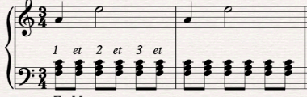

### Sans la tierce
Joués à l'état fondamental, mais sans la tierce.

#### A2 - Noires
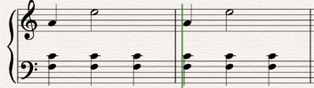

#### C2 - Croches
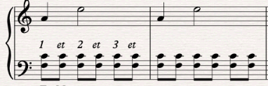

### Fondamentale doublée
Joués à l'état fondamental, mais sans la tierce et on double la fondamentale à l'octave.

#### A3 - Noires
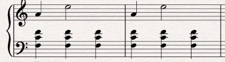

#### C3 - Croches
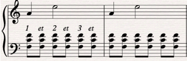

### Avec déplacement
Effectuer un déplacement, en jouant des octaves de la tonique dans le registre très grave sur le premier temps, et en venant jouer l’accord à l’état fondamental une ou deux octaves.
plus haut.

#### A4 - Avec déplacement
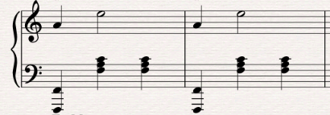

#### C4 - Avec déplacement
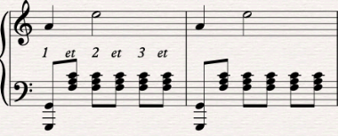

## Arpèges main gauche

### État fondamental
Joués à l'état fondamental, avec ou sans retournements.

#### B1 - Noires
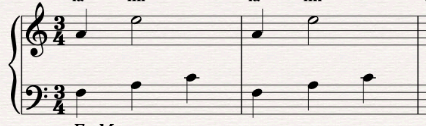

### Fondamentale doublée
Joués à l'état fondamental, mais sans la tierce et on double la fondamentale à l'octave.

#### B3 - Noires

#### D3 - Croches
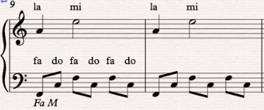

#### E3 - Doubles croches
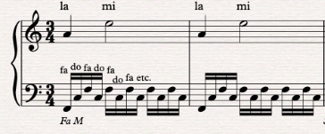

### État fondamental et fondamentale doublée
Joués à l'état fondamental, mais on double tout de même la fondamentale à l'octave.

#### D5 - Croches
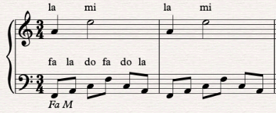

#### E6 - Doubles croches, mouvement ascendant
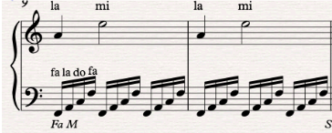

#### E7 - Doubles croches sur 2 octaves
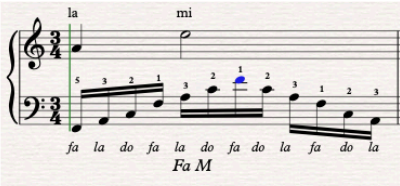
